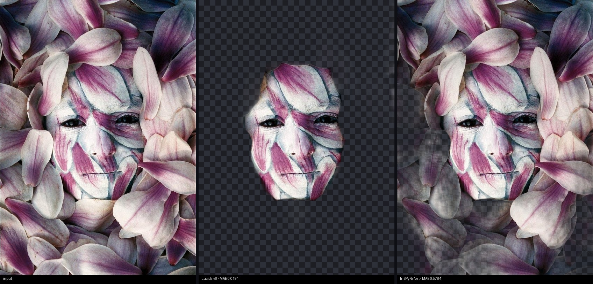
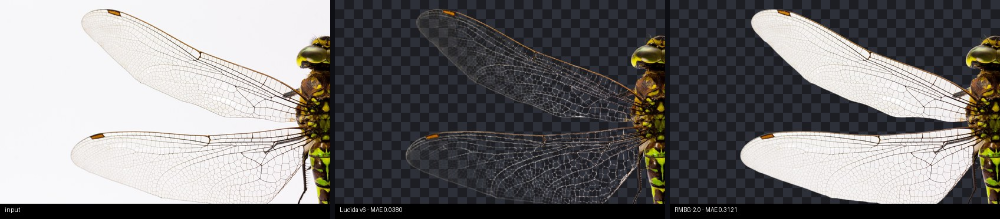
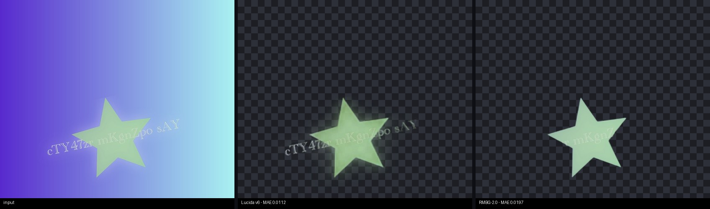
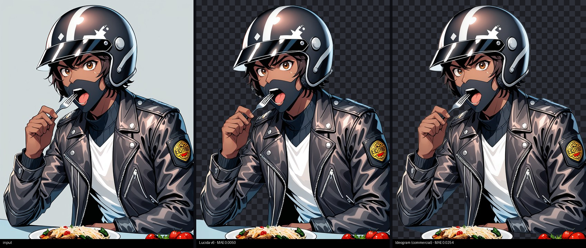

# Lucida

[](https://huggingface.co/egeorcun/lucida)
[](https://huggingface.co/spaces/egeorcun/lucida-demo)
[](LICENSE)
[](https://github.com/egeorcun/lucida/stargazers)

**Background removal that keeps what matters: glass, camouflage, text, glow and line art.**

Lucida is a [BiRefNet](https://github.com/ZhengPeng7/BiRefNet)-based image matting model fine-tuned
specifically for the cases where general-purpose background removers fall apart: semi-transparent
objects, camouflaged subjects, logos and typography with soft shadows, glow/VFX effects, and
illustrations. Weights are on Hugging Face: [egeorcun/lucida](https://huggingface.co/egeorcun/lucida) (MIT). **Try it in your browser (ZeroGPU, a few seconds per image): [live demo](https://huggingface.co/spaces/egeorcun/lucida-demo).**

## Benchmark

191 images, 8 categories, MAE against ground-truth alpha (lower is better). Row leaders in **bold**.
Full methodology in [docs/benchmark.md](docs/benchmark.md); raw table snapshot in
[docs/benchmark-results.md](docs/benchmark-results.md).

| category (n) | lucida-v5 | inspyrenet | ideogram* | rmbg-2.0 | birefnet-hr |
|---|---|---|---|---|---|
| camouflage (25) | **0.0273** | 0.0582 | 0.1179 | 0.1405 | 0.0752 |
| transparent (25) | 0.0376 | 0.0725 | **0.0343** | 0.0741 | 0.0687 |
| complex (29) | 0.0666 | **0.0110** | 0.1046 | 0.0241 | 0.0385 |
| thin (36) | 0.0350 | **0.0166** | 0.0521 | 0.0180 | 0.0196 |
| hair (40) | 0.0087 | 0.0069 | 0.0112 | **0.0045** | 0.0048 |
| text (12) | 0.0126 | 0.0181 | **0.0123** | 0.0173 | 0.0207 |
| fx (12)** | 0.0321 | 0.0269 | **0.0165** | 0.0268 | 0.0272 |
| illustration (12) | **0.0095** | 0.0242 | 0.0215 | 0.0125 | 0.0157 |
| OVERALL (191) | 0.0304 | **0.0277** | 0.0506 | 0.0396 | 0.0334 |

\* *ideogram = [fal.ai Ideogram remove-background](https://fal.ai/models/fal-ai/ideogram/remove-background), a commercial API used as the quality reference.*

\*\* *The fx test images and their ground truth come from the earlier (v4-era) synthetic generator; the fx recipe was reworked for v5 training, so this row is a conservative estimate for lucida-v5.*

**What Lucida wins, honestly:**

- **Camouflage:** 2.1x better than the best open competitor (0.0273 vs InSPyReNet 0.0582) and 4.3x
  better than the commercial reference.
- **Illustration:** ahead of every model measured, including the commercial reference
  (0.0095 vs RMBG-2.0 0.0125, Ideogram 0.0215).
- **Text/logos:** on par with the commercial reference (0.0126 vs 0.0123), clearly ahead of all
  open models.
- **Transparency:** best of the open models by a wide margin (0.0376 vs the next-best open 0.0687).

**And what it loses, just as honestly:**

- **Ideogram still leads transparency** (0.0343 vs our 0.0376). We closed most of the gap; not all of it.
- **InSPyReNet is the specialist for complex scenes and thin structures** (0.0110 / 0.0166 vs our
  0.0666 / 0.0350) — those two categories are also why its overall average is lowest.
- **RMBG-2.0 leads hair** (0.0045 vs our 0.0087), though absolute errors there are small for everyone.

If your workload is mostly multi-object product shots or wiry/perforated structures, InSPyReNet or
RMBG-2.0 may serve you better. If it involves transparency, camouflage, typography, glow effects or
illustrations, Lucida is the strongest open option we measured.

## Examples

Original | Lucida v5 (RGBA on a dark checkerboard) | competitor. MAE per image shown in the labels.

**Camouflage** — body paint blended into magnolia petals; Lucida finds the subject, the runner-up keeps the whole image:



**Transparency** — glass demijohns; the interior stays semi-transparent instead of turning into an opaque blob (beating the commercial reference on this image):



**Text / logo** — lettering with a soft drop shadow over a noisy background; the shadow survives as partial alpha:



**Illustration** — anime-style character on a bench:



## Model

Weights: **[huggingface.co/egeorcun/lucida](https://huggingface.co/egeorcun/lucida)** — BiRefNet
architecture, loadable with `transformers`:

```python
import torch
from PIL import Image
from torchvision import transforms
from transformers import AutoModelForImageSegmentation

model = AutoModelForImageSegmentation.from_pretrained("egeorcun/lucida", trust_remote_code=True)
model.eval()

# 1024x1024 input is the recommended (and trained) resolution.
preprocess = transforms.Compose([
    transforms.Resize((1024, 1024)),
    transforms.ToTensor(),
    transforms.Normalize([0.485, 0.456, 0.406], [0.229, 0.224, 0.225]),
])

image = Image.open("input.jpg").convert("RGB")
with torch.no_grad():
    alpha = model(preprocess(image).unsqueeze(0))[-1].sigmoid().cpu()[0, 0]

alpha_img = transforms.ToPILImage()(alpha).resize(image.size)
rgba = image.copy()
rgba.putalpha(alpha_img)
rgba.save("output.png")
```

## Install & usage

Requires Python >= 3.12. With [uv](https://docs.astral.sh/uv/):

```bash
git clone https://github.com/egeorcun/lucida
cd lucida
uv sync
```

(Plain pip works too: `pip install -e .`)

### CLI

```bash
uv run bgr remove input.jpg -o output.png --model lucida-v5
```

- `--model` picks any entry from `bgr/registry.py` (`lucida-v5`, `rmbg-2.0` (default),
  `birefnet-hr`, `inspyrenet`, ...). The `lucida-v5` entry loads a local checkpoint from
  `data/checkpoints/epoch_5.pth` — download it from the
  [Hugging Face repo](https://huggingface.co/egeorcun/lucida) and place it there.
- `--refine` enables the edge-refinement pass; `--no-decontaminate` disables color
  decontamination of the RGBA output.

### HTTP service (FastAPI)

```bash
uv run uvicorn serving.app:app --port 8756
```

```bash
curl -F "file=@input.jpg" "http://localhost:8756/remove?model=lucida-v5" -o output.png
```

Query parameters: `model` (default `rmbg-2.0`), `refine` (bool), `decontaminate` (bool, default
true). `GET /health` lists the available models.

### Docker

See [docs/docker.md](docs/docker.md).

## How it was trained

Lucida is a fine-tune of **BiRefNet_HR** (MIT) on **52,882 image/alpha pairs across 9 categories**
(transparent, camouflage, complex, thin, hair, text, fx, illustration, general), trained on a single
A100 40GB at 1024x1024, batch 2 x gradient-accumulation 4 (effective batch 8), bf16, using the
official BiRefNet `Matting` task losses (BCE + MAE + SSIM). Five epochs — but not five passes of the
same recipe; each epoch was benchmarked on the 191-image test set and the category sampling was
re-calibrated before the next one:

- **v1 — transparency + camouflage focus.** A `WeightedRandomSampler` pinned those two categories
  at 20% each of every epoch. Camouflage improved immediately, but everything else starved:
  complex/thin/hair collapsed.
- **v2-v3 — rebalance + real backgrounds.** Explicit shares for *all* categories, plus
  original-background (non-composited) training samples. Complex recovered from 0.156 to 0.075 MAE,
  hair to 0.0067, transparency kept improving.
- **v4 — three new capabilities.** Synthetic text/logo renders and procedural glow/VFX data
  (`scripts/make_textfx.py`) plus ToonOut illustrations, together 26% of the epoch. Text (0.0119)
  and illustration (0.0129) immediately reached commercial-reference level — but transparency and
  hair paid for the reallocated share, and the aggressive fx glow data introduced "ghosting"
  (partial alpha on solid objects).
- **v5 — ghosting fix + consolidation.** The fx generator was reworked (narrow halo band, short
  streaks, particles concentrated near the object), its share cut, and transparency/hair shares
  restored. Final epoch-5 sampler shares: transparent .22, complex .19, camouflage .12, thin .12,
  hair .12, text .07, illustration .07, fx .05, general .04.

The full decision log lives in `training/train_colab_lib.py` (sampler preset docstrings) and
`docs/reports/`.

## Datasets & licensing

Training data mixes sources with different licenses. **The model weights are released under MIT,
following the established practice of the field** (BiRefNet itself was trained on largely
research-only academic sets and releases MIT weights) — but a data license is not a weight license,
and whether training-data restrictions propagate to weights is legally unsettled. The table below
is the honest inventory; **commercial users should make their own assessment**, particularly
regarding the research-only sources.

| Source | Category | License | Commercial use |
|---|---|---|---|
| [DIS5K](https://xuebinqin.github.io/dis/index.html) | thin / complex | DIS5K Terms of Use | **Research-only** |
| [CAMO](https://sites.google.com/view/ltnghia/research/camo) | camouflage | CC-BY-NC-SA 4.0 | **Research-only** |
| [COD10K](https://github.com/DengPingFan/SINet) | camouflage | academic release | **Research-only** |
| [P3M-10k](https://github.com/JizhiziLi/P3M) | hair | P3M-10k Release Agreement | **Research-only** (faces blurred for privacy) |
| [Transparent-460](https://huggingface.co/datasets/Thinnaphat/transparent-460) | transparent | not stated | **Treated as research-only** |
| [HIM2K](https://github.com/nowsyn/InstMatt) | general | not stated | **Treated as research-only** |
| [AM-2k](https://github.com/JizhiziLi/GFM) | general | MIT (via release agreement) | Yes |
| [BG-20k](https://github.com/JizhiziLi/GFM) | backgrounds | MIT (via release agreement) | Yes |
| [ToonOut](https://huggingface.co/datasets/joelseytre/toonout) | illustration | **CC-BY 4.0** | Yes, with attribution |
| Synthetic text/fx (this repo) | text / fx | MIT (`scripts/make_textfx.py`) | Yes |

## Limitations

- **Transparency:** the commercial reference (Ideogram) still leads, 0.0343 vs 0.0376 MAE.
- **Complex scenes and thin structures:** InSPyReNet's specialist advantage stands (0.0110/0.0166
  vs our 0.0666/0.0350); RMBG-2.0 leads hair.
- **Semantic coherence:** subject selection on scenes with partially visible people or ambiguous
  multi-object layouts is not perfect — occasional dropped or extra parts.
- **fx measurement:** the fx benchmark row is conservative for v5 (test GT from the older
  generator, see the table footnote).

## License & citation

Code and weights: [MIT](LICENSE).

Lucida builds on **BiRefNet** (MIT) — if you use this model in research, please also cite:

```bibtex
@article{zheng2024birefnet,
  title   = {Bilateral Reference for High-Resolution Dichotomous Image Segmentation},
  author  = {Zheng, Peng and Gao, Dehong and Fan, Deng-Ping and Liu, Li and Laaksonen, Jorma and Ouyang, Wanli and Sebe, Nicu},
  journal = {CAAI Artificial Intelligence Research},
  volume  = {3},
  pages   = {9150038},
  year    = {2024}
}
```

Illustration training and test data come from the **ToonOut** dataset by Joël Seytre
([joelseytre/toonout](https://huggingface.co/datasets/joelseytre/toonout), CC-BY 4.0).
